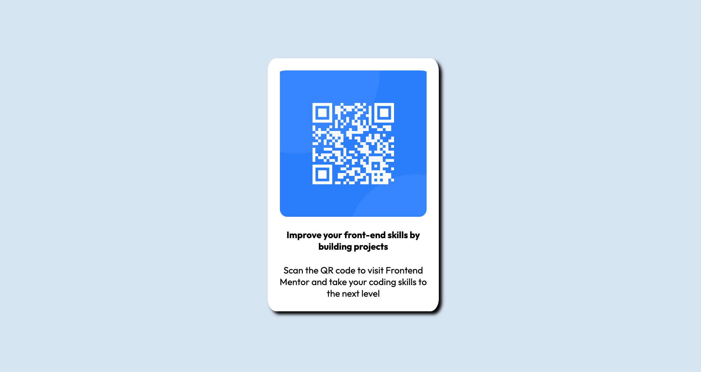

# Frontend Mentor - QR code component solution

## Table of contents

- [Overview](#overview)
  - [Screenshot](#screenshot)
  - [Links](#links)
- [My process](#my-process)
  - [Built with](#built-with)
  - [What I learned](#what-i-learned)
  - [Continued development](#continued-development)
- [Author](#author)

## Overview

This is a solution to the [QR code component challenge on Frontend Mentor](https://www.frontendmentor.io/challenges/qr-code-component-iux_sIO_H). Frontend Mentor challenges help you improve your coding skills by building realistic projects. 

This project was done using basic knowledge of HTML and CSS after completing the Foundations Course from The Odin Project. First project done of my own accord.

### Screenshot

### Links

- Solution URL: [View Code](https://github.com/farhan-navas/qr-code)
- Live Site URL: [Live Demo](https://farhan-navas.github.io/qr-code/)

## My process

### Built with

- Semantic HTML5 markup
- CSS custom properties
- CSS Flexbox
- Mobile-first workflow

**Note: These are just examples. Delete this note and replace the list above with your own choices**

### What I learned

Through this project I was able to apply what basic HTML and CSS knowledge that I have learnt to action, and build this qr-code component from scratch!

### Continued development

After this project, I feel it is important for me to start learning CSS frameworks. The first one that I will be focusing on is Tailwind CSS and after gaining proficiency in this framework I hope to be able to build better styled websites.

I would also like to learn more about JS Libraries and Frameworks, which I am not yet fluent in.

## Author

- Website - Farhan Navas [@farhan-navas](https://github.com/farhan-navas)
- Frontend Mentor - [@wakandakingz](https://www.frontendmentor.io/profile/wakandakingz)
